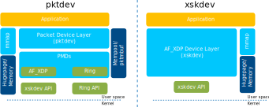

..  SPDX-License-Identifier: BSD-3-Clause
    Copyright (c) 2019-2023 Intel Corporation.

Overview of CNDP Poll Mode Drivers
==================================

.. _Guides_Pmd:

The networking drivers may be classified in two categories:

 * physical for real devices
 * virtual for emulated devices

The pktdev and xskdev layers exposes APIs to use the networking functions
of these devices.

.. note::
   For AF_XDP you have the option of using the low-level xskdev API directly if
   you don't want to use the mempool management that comes with the pktdev API.
   Refer to the :ref:`xskdev buffer management <xsk_buf_mgmt>` guide for
   details.

There are more differences between drivers regarding some internal properties,
portability or even documentation availability.

xskdev
------

This is the lowest level API that abstracts some of the low level complexities
of AF_XDP sockets.

pktdev
------

This is a higher level API that allows you to interact with a number of underlying
devices such as rings and AF_XDP sockets. It has builtin mempool management and
uses the xskdev APIs to create and manage logical ports. The pktdev API uses the
``pktmbuf_t`` structure defined in the :ref:`pktmbuf library <Pktmbuf_Library>`.
