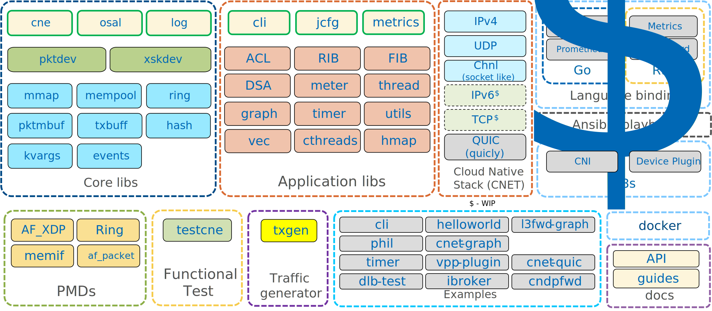

..  SPDX-License-Identifier: BSD-3-Clause
    Copyright (c) 2010-2022 Intel Corporation.

.. _CNDP_Overview:

Overview
========

This section gives a global overview of the architecture of Cloud Native Data Plane (CNDP).

The main goal of the CNDP is to provide a simple, complete framework for fast packet processing in
Cloud Native data plane applications. Users may use the code to understand some of the techniques
employed, to build upon for prototyping or to add their own protocol stacks.

.. _cndp_system_overview:

.. figure:: img/cndp_system_overview.*

   CNDP System Overview

Development Environment
-----------------------

The CNDP project installation requires Linux and the associated toolchain,
such as one or more compilers, assembler, make utility,
editor and various libraries to create the CNDP components and libraries.

See the *CNDP Getting Started Guide* for information on setting up the development environment.

.. _CNDP_Components:

Components
----------
CNDP provides a number of libraries and tools that can be catagorised as follows:

* Core libraries: the core libraries for interacting with an lport
* Application libraries: libraries with additional functionality that can be used by apps.
* PMDs: the PMDs enabled in CNDP.
* Functional Test: testcne - a functional test framework.
* Ansible Playbooks: Playbooks for setting up the CNDP Development environment.
* Docker and Kubernetes: Docker files, Pod specs and instructions for getting started with CNDP in a Kubernetes env.
* Language bindings

An incomplete picture of the architecture is shown here.

.. _figure_architecture-overview:

The following section shows the breakdown of these libraries under the lib/core directory.

Cloud Native Environment (cne)
~~~~~~~~~~~~~~~~~~~~~~~~~~~~~~

Initializes the application environment and provides runtime services like unique
thread ids.

Events
~~~~~~

Library to manage epoll event callbacks.

Hash
~~~~

Hash table implementation with various hash functions.

Key Value
~~~~~~~~~

Library to parse key-value pairs.

Log
~~~

Logging services with various debug levels.

Memory Pool Manager
~~~~~~~~~~~~~~~~~~~

The Memory Pool Manager is responsible for allocating pools of objects in memory. A pool is
identified by name and uses a ring to store free objects. It provides some other optional services,
such as a per-core object cache and an alignment helper to ensure that objects are padded to spread
them equally on all DRAM channels.

This memory pool allocator is described in :ref:`Mempool Library <Mempool_Library>`.

Memory Map (mmap)
~~~~~~~~~~~~~~~~~

A memory allocator using mmap(). This memory is usually passed to a mempool.

OS Abstraction Layer (osal)
~~~~~~~~~~~~~~~~~~~~~~~~~~~

Library to abstract some things like reading cpu counts from the file-system
or interacting with a netdev.

Network Packet Buffer Management (pktmbuf)
~~~~~~~~~~~~~~~~~~~~~~~~~~~~~~~~~~~~~~~~~~

The pktmbuf library provides the facility to create and destroy buffers that may be used by the
CNDP application to store message buffers. The message buffers are created at startup time and
stored in a mempool, using the CNDP mempool library.

This library provides an API to allocate/free mbufs, manipulate packet buffers which are used
to carry network packets.

Network Packet Buffer Management is described in :ref:`pktmbuf Library <Pktmbuf_Library>`.

Poll-Mode Drivers (pmds)
~~~~~~~~~~~~~~~~~~~~~~~~

PMDs implement the pktdev API. For more information, see :ref:`PMD Guide <Guides_Pmd>`.

Ring
~~~~

The ring structure provides a lockless multi-producer, multi-consumer FIFO API in a finite size
table. It has some advantages over lockless queues; easier to implement, adapted to bulk operations
and faster. A ring is used by the :ref:`Memory Pool Manager (mempool) <Mempool_Library>` and may be
used as a general communication mechanism between cores and/or execution blocks connected together
on a logical core.

This ring buffer and its usage are fully described in :ref:`Ring Library <Ring_Library>`.

Tx Buffer (txbuff)
~~~~~~~~~~~~~~~~~~

Provide buffering for packets before transmission.

xskdev
~~~~~~

This is a low level API that abstracts some of the complexities of AF_XDP sockets.

pktdev
~~~~~~

This is a high level API that allows you to interact with a number of underlying devices such as
rings and AF_XDP sockets. It has inbuilt mempool management and uses the xskdev APIs to create and
manage logical ports.

Application Libraries (lib/usr/app)
~~~~~~~~~~~~~~~~~~~~~~~~~~~~~~~~~~~

Libraries providing services for applications such as json-c config file parsing and Unix Domain
Socket (UDS) handling.

C Language Libraries (clib)
~~~~~~~~~~~~~~~~~~~~~~~~~~~

Libraries providing services to packet processing applications such as Access Control List (ACL) and
timer implementations.

    * ACL an AVX 512 enabled Access Control List library

    * cthread a userspace lightweight threading library

    * Intel(R) Data Streaming Accelerator (Intel(R) DSA)

CNET - Cloud Native Network stack (lib/cnet)
--------------------------------------------

The libraries under the cnet directory create the CNET stack, which uses the :ref:`Graph Library <Graph_Library>`.
These include nodes for UDP/IPv4/QUIC with IPv6/TCP in the future.

The CNET stack gets most of its configuration via netlink messages. Using netlink allows CNET to be
configured via the host command line tools. Using tools like ``ifconfig`` or ``ip`` or ``arp`` the user
can configure the CNET and allow CNET to detect changes in the system network configuration.

The :numref:`cnet_overview` shows the basic layout of the CNDP with CNET stack and components.

.. _cnet_overview:

.. figure:: img/cnet_overview.*

   CNET Overview
