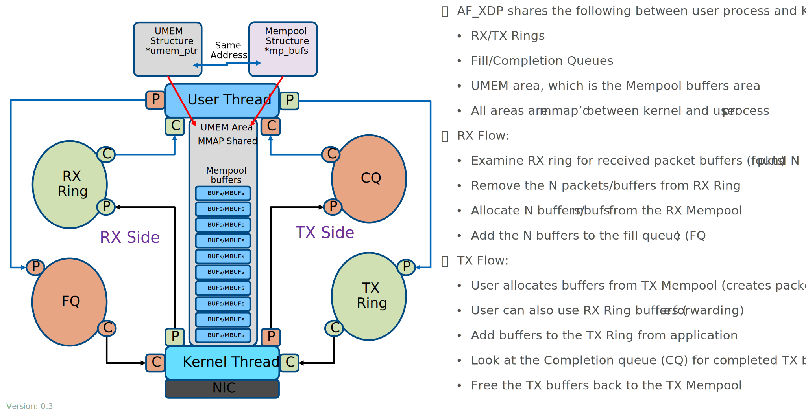

..  SPDX-License-Identifier: BSD-3-Clause
    Copyright (c) 2010-2022 Intel Corporation.

.. _Pktmbuf_Library:

Pktmbuf Library
===============

The pktmbuf library provides the ability to allocate and free buffers (pktmbufs)
that may be used by the CNDP application to store message buffers.
The message buffers are stored in a mempool, using the :ref:`Mempool Library <Mempool_Library>`.

A pktmbuf struct generally carries network packet buffers, but it can actually
be any data (control data, events, ...).
The pktmbuf header structure is kept as small as possible and currently uses
just one cache line, with the most frequently used fields being in that cache line.

Design of Packet Buffers
------------------------

For the storage of the packet data (including protocol headers),
embed metadata within a single memory buffer the structure followed by a fixed size area for the packet data.
The advantage of this method is that it only needs one operation to allocate/free the whole memory representation of a packet.

The metadata contains control information such as message type, length, offset to the start of the data
and some commonly used metadata checksum offload with protocol header offsets/lengths.

For a newly allocated pktmbuf, the area at which the data begins in the message buffer is
CNE_PKTMBUF_HEADROOM bytes after the beginning of the buffer, which is cache aligned.
Message buffers may be used to carry control information, packets, events,
and so on between different entities in the system.

:numref:`figure_pktmbuf_layout` shows the basic layout of pktmbuf_t structure related to Mempool structures.

.. _figure_pktmbuf_layout:

.. figure:: img/pktmbuf_layout.*

   Pktmbuf Layout

The Buffer Manager implements a fairly standard set of buffer access functions to manipulate network packets.
The following set of figures help define the Rx/Tx usage model with AF_XDP.

.. _RX_UMEM_Buffer:

.. figure:: img/RX-UMEM-Buffer.*

   RX UMEM pktmbuf layout

The TX buffer layout is the same as the RX buffer layout, but it does use some different offset values
to align with AF_XDP requirements.

.. _TX_UMEM_Buffer:

.. figure:: img/TX-UMEM-Buffer.*

   TX UMEM pktmbuf layout

The Rx/Tx buffers are somewhat defined by the AF_XDP UMEM buffer layout.

Pktmbuf and UMEM layout
-----------------------

The AF_XDP design uses a UMEM buffer and rings to move data from userspace to kernel. The rings
operate on UMEM buffer offsets instead of memory points to account for kernel and userspace having
different address spaces. A UMEM is one large memory array of buffers for packet data to be sent and
received to remove having to copy the packet to/from the kernel/userspace.

A UMEM buffer space can be shared between between multiple AF_XDP sockets, which allows buffers to
be shared between sockets without needing to copy the packet data. If using multiple UMEMs with
different AF_XDP sockets plus sending packets between these UMEMs the application would need to
copy the data. Normally, a set of AF_XDP sockets will share a single UMEM. CNDP uses mempools to
allocate and free buffers to get the best performance, which means each AF_XDP socket needs to have
its own mempool set of buffers in the UMEM buffer space.

A multiple AF_XDP sockets could share a single mempool, but a socket could starve other sockets of
buffers if some type of limit is put into place. We use a mempool per socket to achive this type of
limiting of a single socket consuming all of the buffers.

.. _multiple_mempools_umem:

.. figure:: img/multiple-mempools-umem.*

   UMEM with multiple pktmbuf pools

Buffers Stored in Memory Pools (UMEM)
---------------------------------------------

The Buffer Manager uses the :ref:`Mempool Library <Mempool_Library>` to allocate buffers.
For CNDP we use a mempool to help define and allocate buffers from a UMEM with AF_XDP. When creating a UMEM we use the
mempool buffer memory as the UMEM buffers memory as in the figure :numref:`umem_mbuf` below.
An pktmbuf contains a field indicating the pool that it originated from.
When calling pktmbuf_free(m), the pktmbuf returns to its original pool.

.. _umem_mbuf:

   AF_XDP memory layout

Constructors
------------

Packet pktmbuf constructors are provided by the API.
The pktmbuf_init() function initializes some fields in the pktmbuf structure that
are not modified by the user once created (pktmbuf type, origin pool, buffer start address, and so on).
This function is given as a callback function to the mempool_create() function at pool creation time.

Allocating and Freeing pktmbufs
-------------------------------

Allocating a new pktmbuf requires the user to specify the mempool from which the pktmbuf should be taken.
For any newly-allocated pktmbuf, it contains one segment, with a length of 0.
The offset to data is initialized to have some bytes of headroom in the buffer (CNE_PKTMBUF_HEADROOM).

Freeing a pktmbuf means returning it into its original mempool.
The content of an pktmbuf is not modified when it is stored in a pool (as a free pktmbuf).
Fields initialized by the constructor do not need to be re-initialized at pktmbuf allocation.

Manipulating pktmbufs
---------------------

This library provides some functions for manipulating the data in a packet pktmbuf. For instance:

    *  Get data length

    *  Get a pointer to the start of data

    *  Prepend data before data

    *  Append data after data

    *  Remove data at the beginning of the buffer (pktmbuf_adj())

    *  Remove data at the end of the buffer (pktmbuf_trim()) Refer to the *CNDP API Reference* for details.

Meta Information
----------------

Some information is stored in the pktmbuf header i.e. data offset, packet length, lport number,
offload data and other information about the packet. More optional metadata is stored after the
header in a metadata structure, which part of the headroom of the pktmbuf. The metadata information
is currently used by the CNET stack to hold more information about the packet.

At this time CNDP does not support chaining of pktmbuf_t structures.
