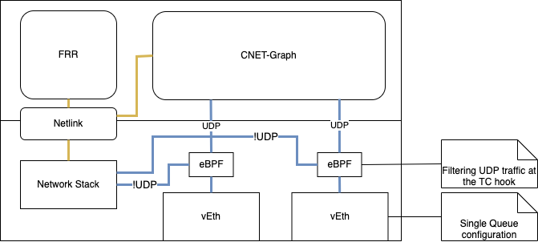

# CNDP-FRR Demo

This directory shows how to run a simple example of CNDP working with FRR. Two clients
reside in two different networks are interconnected via simple OSPF vRouters. One
running cndp-frr and the other running vanilla frr.


> **_NOTE:_** This is not a performance optimized demo.
> **_NOTE:_** All container interfaces in this example are veth interfaces.

This example loads a custom BPF program on the cndp-frr1 and the cndp-frr2
veth interfaces to filter UDP traffic to CNDP and all other traffic to the kernel. As the ethtool filtering capability cannot be used with this type
of interface.

> **_NOTE:_** CNDP is using the pinned map feature to access an xskmap loaded
through an xdp program with xdp-loader.

The flow of traffic is shown in the diagram below:



## 1. Build cndp-frr image

If you wish to build the CNDP-FRR docker images locally then in the top level directory of this repo run:

```cmd
[root@nfvsdn-06 cndp]# make cndp-frr-image
docker selected
docker build -t cndp-frr --build-arg http_proxy= \
  --build-arg https_proxy= -f examples/cndp-frr/docker/Dockerfile .
[+] Building 47.6s (63/63) FINISHED                                                             docker:default
 => [internal] load build definition from Dockerfile                                                      0.0s
 => => transferring dockerfile: 3.96kB                                                                    0.0s
 => [internal] load .dockerignore                                                                         0.0s
 [...]
 => [57/64] WORKDIR /cndp-frr/my-filter-udp-to-xdp/                                                       0.0s
 => [58/64] RUN make                                                                                      0.8s
 => exporting to image                                                                                   10.8s
 => => exporting layers                                                                                  10.8s
 => => writing image sha256:937cb920a53351e92c84bc03b4a59d0c9077fd3e17bcff0af871bbdec82312f1             0.0s
 => => naming to docker.io/library/cndp-frr
```

## 2. Setup docker networks and run docker containers

```cmd
# make cndp-frr-run
Starting up cndp-frr example
./examples/cndp-frr/scripts/setup-demo.sh
f5a7d0ae5866e0b0f8d01b150bd09d88c7550af32011844d8f13cb8765855831
b1abb76bda0eab1b2a202450ca8c4417390bc699396b27ca1a1f5d2b258f7f97
ff96596a92f331346d03871beb48baf13b7e6c334ba86670abae3503336c5d02
278544a54bd2bed089698edd50d6a32abe29a1eecf52dd92a044b99366fc7be0
708beba63dffe23381bc9959e2d6ec08a6ba31ca7ae031b161000bb28dedc373
b3300bb0d6d24b80e6ead46cad7ab2aab8de1f422faa6df24c27cf413daed349
3d6d3642e9864c6ba3268cdbf348566e733cf07e54e496e53047ef700691d717
```

## 3. Check that clients can't ping one another

```cmd
# docker exec client2 ping 172.19.0.2
```

## 4. Start cnet-graph application on cndp-frr1

Connect to the docker container

```cmd
# docker exec -ti cndp-frr1 bash
```

Navigate to the cnet-graph directory and run the application

```cmd
# cd /cndp/builddir/examples/cnet-graph/;./cnet-graph -c cnetfwd-graph.jsonc
```

Output should be something like:

```cmd
*** CNET-GRAPH Application, Mode: Drop, Burst Size: 128

*** cnet-graph, PID: 57 lcore: 1

** Version: CNDP 23.11.0, Command Line Interface
```

Check the routing information:

```cmd
CNDP-cli:/> ip route
Route Table for CNET on lcore 5
  Nexthop           Mask               IF  Gateway           Metric Timeout   Netdev
  172.19.0.3        255.255.255.255     0  0.0.0.0               16       0   eth0:0
  172.20.0.3        255.255.255.255     1  0.0.0.0               16       0   eth1:0
  172.19.0.0        255.255.0.0         0  0.0.0.0               16       0   eth0:0
  172.20.0.0        255.255.0.0         1  0.0.0.0               16       0   eth1:0
```

Leave this application running!

## 5. Start cnet-graph application on cndp-frr2

Connect to the docker container

```cmd
# docker exec -ti cndp-frr2 bash
```

Navigate to the cnet-graph directory and run the application

```cmd
# cd /cndp/builddir/examples/cnet-graph/;./cnet-graph -c cnetfwd-graph.jsonc
```

Output should be something like:

```cmd
*** CNET-GRAPH Application, Mode: Drop, Burst Size: 128

*** cnet-graph, PID: 57 lcore: 1

** Version: CNDP 23.11.0, Command Line Interface
```

Check the routing information:

```cmd
CNDP-cli:/> ip route
Route Table for CNET on lcore 0
  Nexthop           Mask               IF  Gateway           Metric Timeout   Netdev
  172.20.0.2        255.255.255.255     0  0.0.0.0               16       0   eth0:0
  172.21.0.3        255.255.255.255     1  0.0.0.0               16       0   eth1:0
  172.20.0.0        255.255.0.0         0  0.0.0.0               16       0   eth0:0
  172.21.0.0        255.255.0.0         1  0.0.0.0               16       0   eth1:0
```

Leave this application running!

## 6. Configure and start FRR

### For cndp-frr1

Connect to the cndp-frr1 container

```cmd
# docker exec -ti cndp-frr1 bash
```

Start FRR

```cmd
# source startup.sh
```

### For cndp-frr2

Connect to the cndp-frr2 container

```cmd
# docker exec -ti cndp-frr2 bash
```

Start FRR

```cmd
# source startup.sh
```

## 8. Check FRR settings
### cndp-frr1 settings

Check configuration with vtysh.

```cmd
$ vtysh

Hello, this is FRRouting (version 7.5_git).
Copyright 1996-2005 Kunihiro Ishiguro, et al.

frr1# show run
Building configuration...

Current configuration:
!
frr version 8.3-dev-MyOwnFRRVersion
frr defaults traditional
hostname 4101efc2cfd2
log syslog informational
no ipv6 forwarding
service integrated-vtysh-config
!
interface lo
 ip address 1.1.1.1/32
exit
!
router ospf
 network 172.19.0.0/16 area 0.0.0.0
 network 172.20.0.0/16 area 0.0.0.0
 router-info area
exit
!
end
```

### cndp-frr2 settings

```cmd
$ vtysh

Hello, this is FRRouting (version 7.5_git).
Copyright 1996-2005 Kunihiro Ishiguro, et al.

frr1# show run
```

With the settings up to this point, if you enter frr1 and check the ip route, 172.21.0.0/16 is added in OSPF.

```cmd
frr1# show ip route
Codes: K - kernel route, C - connected, S - static, R - RIP,
       O - OSPF, I - IS-IS, B - BGP, E - EIGRP, N - NHRP,
       T - Table, v - VNC, V - VNC-Direct, A - Babel, F - PBR,
       f - OpenFabric,
       > - selected route, * - FIB route, q - queued, r - rejected, b - backup
       t - trapped, o - offload failure

K>* 0.0.0.0/0 [0/0] via 172.19.0.1, eth0, 00:02:13
C>* 1.1.1.1/32 is directly connected, lo, 00:02:13
O   172.19.0.0/16 [110/10] is directly connected, eth0, weight 1, 00:00:47
C>* 172.19.0.0/16 is directly connected, eth0, 00:02:13
O   172.20.0.0/16 [110/10] is directly connected, eth1, weight 1, 00:00:42
C>* 172.20.0.0/16 is directly connected, eth1, 00:02:13
O>* 172.21.0.0/16 [110/20] via 172.20.0.2, eth1, weight 1, 00:00:36
The neighbour is also properly recognised.
```

```cmd
frr1# show ip ospf neighbor

Neighbor ID     Pri State           Up Time         Dead Time Address         Interface                        RXmtL RqstL DBsmL
2.2.2.2           1 Full/DR         56.401s           38.597s 172.20.0.2      eth1:172.20.0.3                      0     0     0
```

## 9. Check the routes in the cnet-graph application on cndp-frr1

```cmd
CNDP-cli:/> ip route
Route Table for CNET on lcore 0
  Nexthop           Mask               IF  Gateway           Metric Timeout   Netdev
  172.19.0.3        255.255.255.255     0  0.0.0.0               16       0   eth0:0
  172.20.0.3        255.255.255.255     1  0.0.0.0               16       0   eth1:0
  172.19.0.0        255.255.0.0         0  0.0.0.0               16       0   eth0:0
  172.20.0.0        255.255.0.0         1  0.0.0.0               16       0   eth1:0
  172.21.0.0        255.255.0.0         1  172.20.0.2            16       0   eth1:0
```

## 10. Check connectivity and run iperf between the clients from the host side

```cmd
# docker exec client2 ping 172.19.0.2
```

```cmd
# docker exec client1 iperf -s -u
```

```cmd
# docker exec client2 iperf -c 172.19.0.2 -u -l 512
------------------------------------------------------------
Client connecting to 172.19.0.2, UDP port 5001
Sending 1470 byte datagrams, IPG target: 11215.21 us (kalman adjust)
UDP buffer size:  208 KByte (default)
------------------------------------------------------------
[  1] local 172.21.0.2 port 60784 connected with 172.19.0.2 port 5001
[ ID] Interval       Transfer     Bandwidth
[  1] 0.00-10.02 sec  1.25 MBytes  1.05 Mbits/sec
[  1] Sent 896 datagrams
```

## References

[Simple FRR OSPF configuration](https://linuxtut.com/en/648e225d06085a0e2530/)
